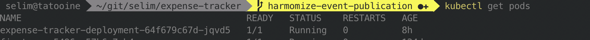

# DDD-lite Expense tracker application 

## Introduction

This application is made to showcase DDD-Lite within a modular monolith application. The motivation
behind this is to show that a monolith can be implemented consistently and easily migrated to a
microservice architecture ,if needed, some time in the future.

The application represents an expense tracker with a very limited set of features, but the intent is
to demonstrate ,given a simplified business problem, how modules shall be implemented and put
together. 

## Architecture


## Features

The application exposes the following APIs, that cab be accessed through swagger at 
`http://localhost:8080/swagger-ui.html#/`

* Create user

* Add an expense

* Get expenses by user

* Get audit trail

 
 
## Technical Environment

Expense tracker is a self contained application based on **Spring Boot** that runs an embedded
servlet container running by default on port 8080 that expose a **REST API**. 

The following list the main frameworks and libraries used to implement this application:

- [spring boot](https://spring.io/projects/spring-boot): Simple and rapid framework to create
 simple and web based applications.
- [lombok](https://projectlombok.org/) : Framework auto generating code for java (getter, setter, ...).
- [vavr](http://www.vavr.io): Functional library for java.
- [h2](https://www.h2database.com/html/main.html) : Lightweight in-memory relational database.
- [swagger](https://swagger.io/): Specification for machine-readable interface files for
describing, producing, consuming, and visualizing RESTful web services 
- [spock](https://github.com/spockframework/spock): BDD-style testing and specification framework for Java and Groovy. 
 

## Requirements

* Java 11
* Groovy 2.5 or higher
* Maven 3.5 or higher
* Docker (optional)
* Kubernetes (optional)

## Build

```  
mvn clean package 
```

## Run the application

###  IDE

Run the main class `com.sy.expense.tracker.server.ExpenseTrackerApplication`.

###  Maven

Open your terminal, navigate to the `ExpenseTrackerApplication` source directory then enter
 `server` directory. Run the following command: 

```
mvn spring-boot:run
```

### Java

Open your terminal, navigate to the `ExpenseTrackerApplication` source directory then enter
`server` directory. Run the following command:  

```
java -jar target/server-1.0-0-SNAPSHOT.jar
```


### Docker

Open your terminal, navigate to the `ExpenseTrackerApplication` source directory then enter the
 `server` directory. Run the following command:
 
```
mvn compile jib:dockerBuild
```

The command above dockerize and install the application in your local docker daemon. You can
issue the following command to view the docker image of the application   

```
docker images
```


then issue the following the command to run the docker container:

```
docker run -p 8080:8080 sy/expense-tracker:1.0.0-SNAPSHOT
``` 

### Kubernetes

#### Setup the docker registry

* If you run mini-kube make sure that Kubernetes is able to use your local docker daemon by issuing
the following command:

```
eval $(minikube docker-env)
```

* If you use docker desktop everything should work out of the box.

#### Deploy the application

* Open your terminal, navigate to the `server/kubernetes` directory then issue the following
 commands:

```
kubectl apply -f server/kubernetes/expense-tracker-deployment.yaml
kubectl apply -f server/kubernetes/expense-tracker-service.yaml
```

You should have this when issuing the commands:

```
kubectl get pods
```



```
kubectl get services
```


* Open your terminal, run the following access so that the application can be accessible from your
terminal or browser

```
kubectl port-forward svc/expense-tracker-service 8080:8080
``` 
